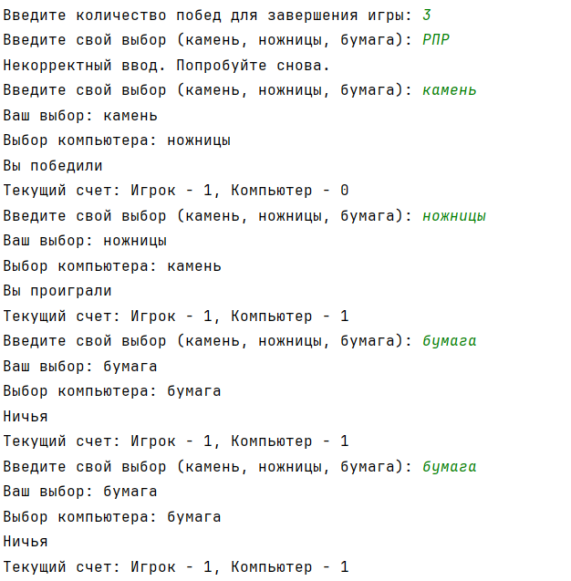
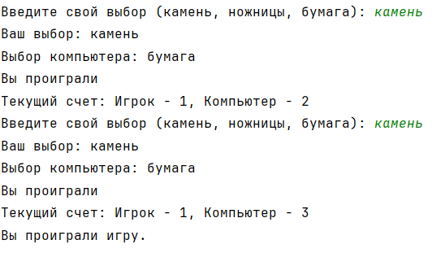
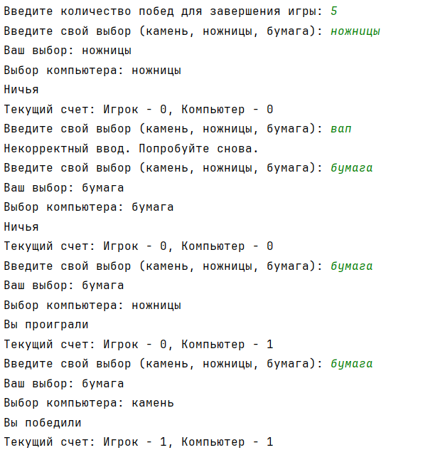
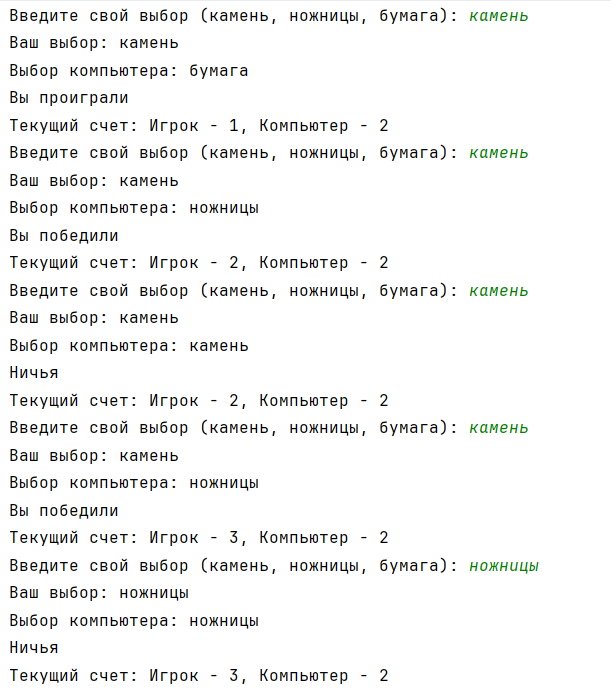
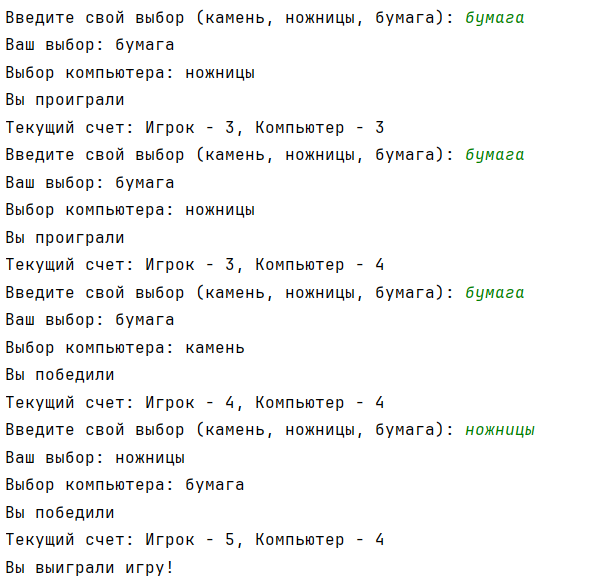
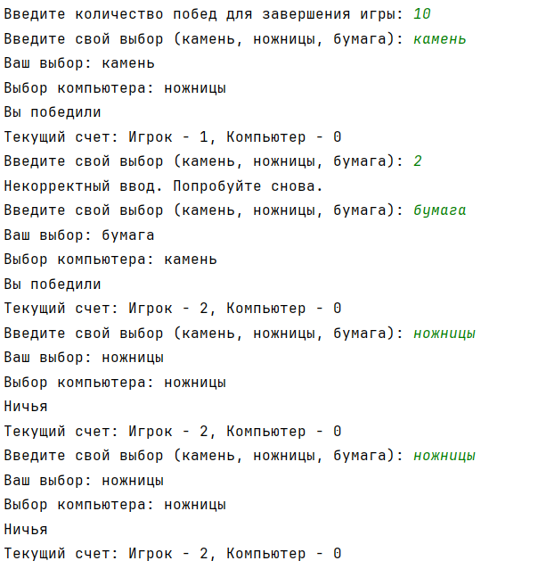
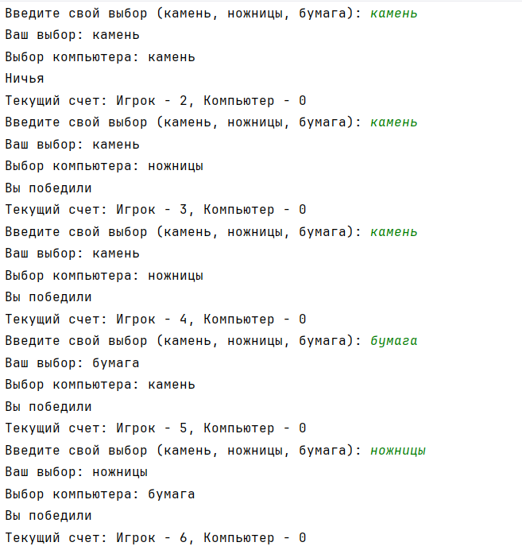
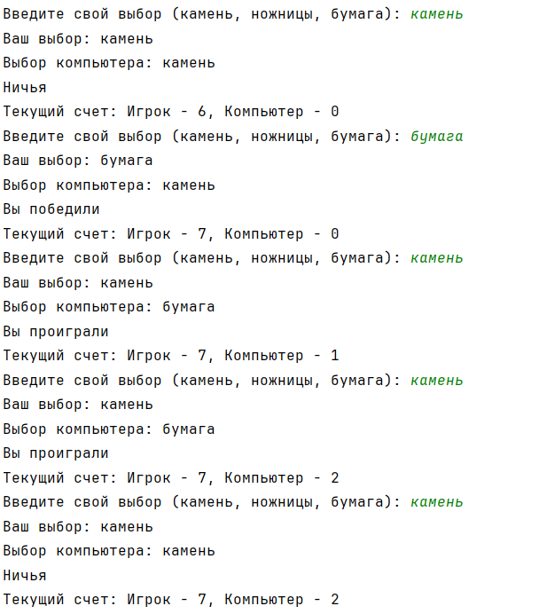
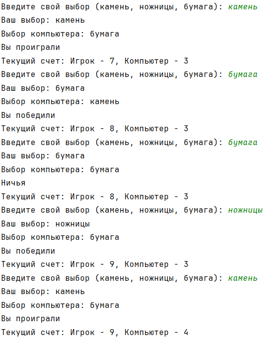
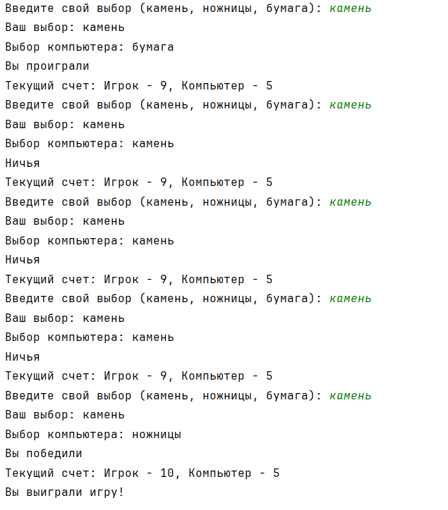

# Исполнитель

Баженов Данил
Группа Фт-240008

# Среда разработки

Язык программирования: Python.
Среда разработки: PyCharm

# Лабораторная работа №13

Задача:

Написать на любом языке программу игры "Камень - ножницы - бумага" 

Программа должна обеспечивать:

1. в начале игры необходимо договориться до какого счёта идёт игра (сколько побед), 
2. вывод текущего счёта с фиксацией победителя, 
3. возможность прекратить игру в любой момент с фиксацией текущего счёта

# Инструкция по работе

Необходимо запустить файл knb.py, находящийся в каталоге /КНБ, далее вводить все необходимые данные, которые запрашивет программа

# Результаты тестирования

Тест 1 + проверка надежности

Тест 2 + проверка надежности

Тест 3

